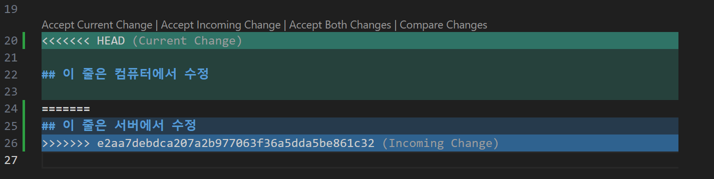

# Git Demo

## Github 연습

```
cd git-demo
```

```
git add
git commit
git push
```
## Github에서 추가한 내용

```
git pull
```

## 이 행은 컴퓨터와 서버 양쪽에서 모두 수정한적 있음


```
git config pull.rebase false
```
- 입력 후 버그가 있는 곳을 해결한 후 다시 add -> commit -> push